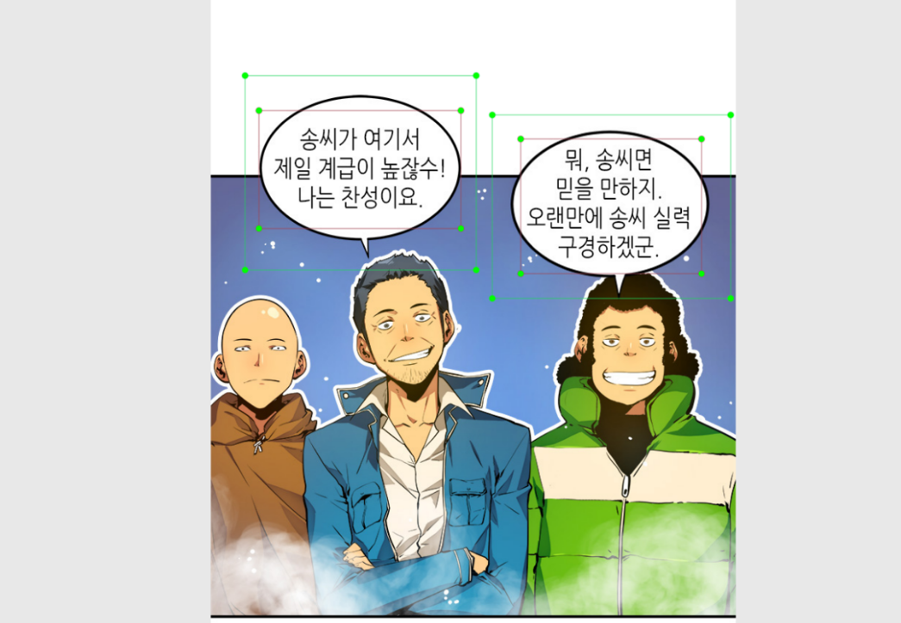
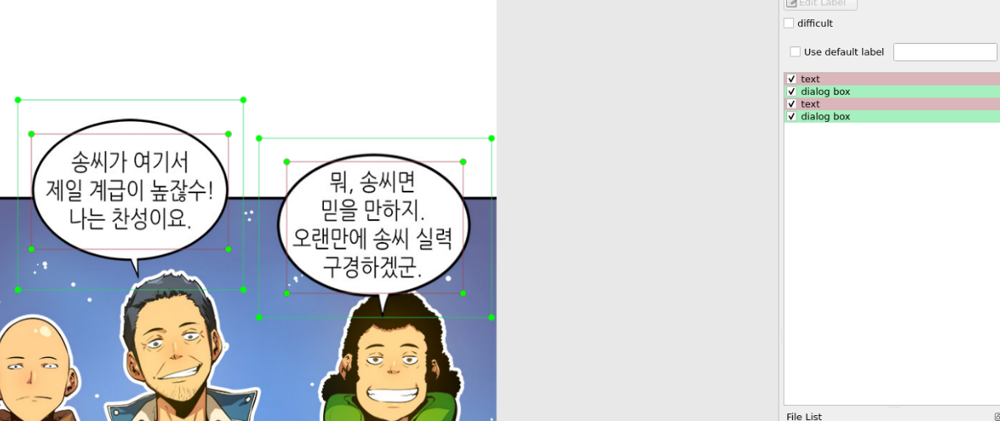

# webtoon-dataset

 

This Webtoon dataset collect using Scrapy.

Not complete yet, but will be perfect in the near future 

## Content

using labelImg for labelling objects in webtoon dataset.

Related Work 

1. OCR translate manga/manhwa to english/indonesia (being worked on)

2. AI-nime (Neural Transfer Style for Anime Photo/Video) (being worked on)

# 
